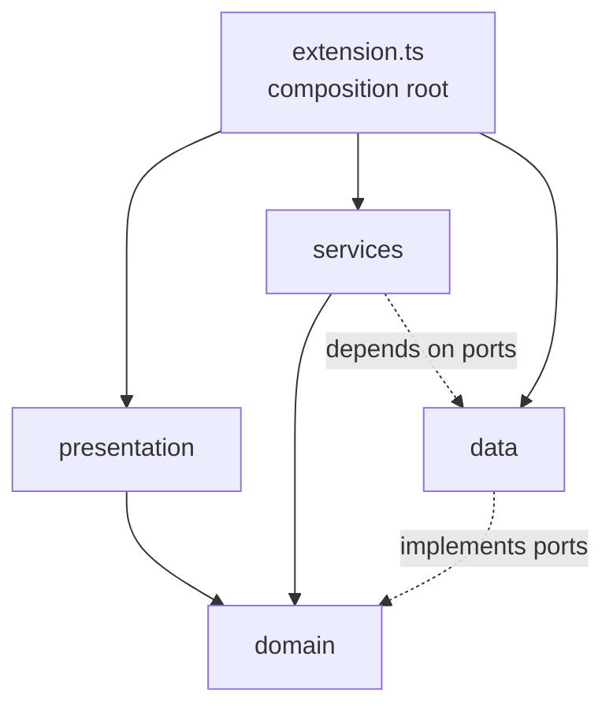

# Architecture

This document gives contributors a map of the codebase. The extension lives in
[`extension/`](extension); the rest of the repo holds developer tooling
(`tools/`) and research notes (`docs/`).

## Layered design

The code follows a layered architecture with a strict **dependency rule**:
dependencies point inward, and the `domain` layer never imports the `vscode`
API. The `vscode` runtime is injected from the composition root so the core
logic stays unit-testable in plain Node.

| Layer          | Folder                  | Responsibility                                                        | May import `vscode`? |
| -------------- | ----------------------- | -------------------------------------------------------------------- | -------------------- |
| `domain`       | `src/domain`            | Pure types and logic: pricing, cost math, aggregation, filters       | No                   |
| `data`         | `src/data`              | Read SQLite / JSON sources behind interfaces (ports)                  | No (filesystem only) |
| `services`     | `src/services`          | Orchestration: polling lifecycle, history persistence, budget alerts | Only via interfaces  |
| `presentation` | `src/presentation`      | VS Code surfaces: sidebar webview, status bar, notifications         | Yes                  |
| composition    | `src/extension.ts`      | Resolve paths, construct, wire, and dispose everything               | Yes                  |

## Key abstractions (Dependency Inversion)

Services depend on interfaces, not concrete classes. The implementations are
chosen and injected in `extension.ts`:

- `ISpanRepository` (`data/interfaces.ts`) — fetch cost spans.
  Implemented by `AgentTracesRepository` (primary) and `DebugLogsRepository` (fallback).
- `ITurnLabelProvider` (`data/interfaces.ts`) — resolve per-turn labels.
  Implemented by `AgentTracesRepository` only; injected separately so the
  debug-logs fallback is never forced to provide it.
- `ISessionTitleResolver` (`data/interfaces.ts`) — resolve chat session titles
  and workspaces. Implemented by `StateRepository`.
- `INotifier` (`services/INotifier.ts`) — user-facing warnings/errors.
  Implemented by `VsCodeNotifier` in the presentation layer, so
  `BudgetAlertService` never touches the `vscode` API directly.

Adding a new model's pricing is an Open/Closed change: edit
`domain/pricing-data.ts`, not the resolution logic in `domain/PricingEngine.ts`.

## Data flow (one poll cycle)

1. `CostTrackingService.poll()` runs on a timer (re-entrancy guarded).
2. It reads spans from `AgentTracesRepository`; if `costDataSource` is
   `with-fallback` and traces are unavailable, it backfills from
   `DebugLogsRepository`.
3. `Aggregator` turns spans into a `DashboardData` snapshot, pricing each model
   via `CostCalculator` + `PricingEngine` (unknown models are flagged
   `estimated`/`unpriced`).
4. The service fires `onDidUpdate`, which fans out to:
   - `BudgetAlertService.evaluate()` → threshold notifications + budget state,
   - `StatusBarController.update()`,
   - `SidebarWebviewProvider.updateData()`.
5. Periodically, `CostHistoryService` scrapes the snapshot to disk so data
   survives `agent-traces.db` resets.

## Reading native SQLite

`better-sqlite3` is a native module compiled against Node's ABI, which differs
from the Electron ABI used by VS Code. To avoid ABI mismatches, the databases
are read in a **child process** (`data/db-worker.js`) launched with the system
Node.js. `data/sqlite.ts` owns that process: it spawns the worker, waits for a
readiness handshake (with a startup timeout), and exchanges requests over an
NDJSON protocol on stdin/stdout.

## Path resolution

No storage path is hardcoded. `extension.ts` derives VS Code's `User` directory
from `context.globalStorageUri` (`<User>/globalStorage/<ext-id>`), so the
correct location is found across OSes and product flavours (Stable, Insiders,
VSCodium, portable). Session ids that flow into filesystem paths are validated
by `data/identifiers.ts` to prevent path traversal.

## Testing

Unit tests use [Vitest](https://vitest.dev). `vitest.config.ts` aliases the
`vscode` import to `test/mocks/vscode.ts`, so domain and service code can be
tested without the extension host. Run `npm test` (or `npm run test:coverage`)
from `extension/`.
