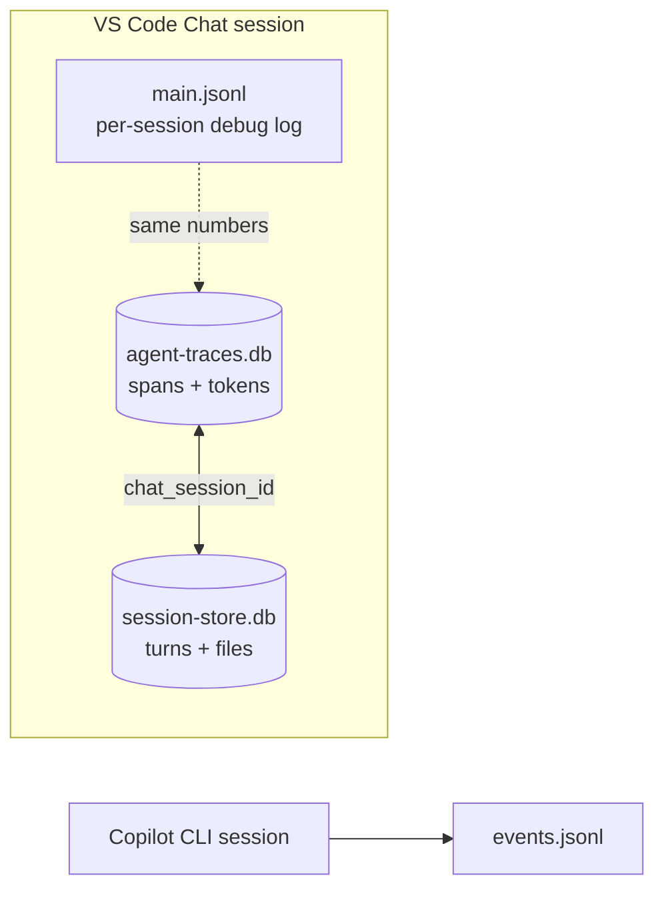

# Copilot Data Sources

This repo studies how GitHub Copilot persists per-session telemetry and conversation state. Copilot writes to **multiple stores in parallel**; understanding which one holds what is the key to extracting accurate usage data.

## TL;DR — which file to use for what

| Need | Use |
|------|-----|
| Token counts, cache, model, TTFT, per-tool calls (VS Code Chat) | **`agent-traces.db`** |
| User & assistant text, tracked files, checkpoints (VS Code Chat) | **`session-store.db`** |
| Session titles (VS Code-generated names) | **`state.vscdb`** → `chat.ChatSessionStore.index` |
| Token counts for a debug-enabled VS Code Chat session (no cache write) | **`main.jsonl`** (matches `agent-traces.db` except cache_creation) |
| Session name fallback (first user message) | **`main.jsonl`** → `user_message` events |
| Copilot CLI (`copilot-agent`) — turns, tools, modes (no tokens) | **`events.jsonl`** |

---

## 1. `agent-traces.db`  *(structured telemetry — cost source of truth)*

**Location**

```
%APPDATA%\Code\User\globalStorage\github.copilot-chat\agent-traces.db
```

**Format:** SQLite (WAL journaling). The active `*.db-wal` file may contain MBs of un-checkpointed writes — reading the main file with `sql.js` will miss those until VS Code flushes (or you run `PRAGMA wal_checkpoint(TRUNCATE)` from a real sqlite client).

**Shape:** OpenTelemetry-style spans.

### Tables

#### `spans`  (one row per operation)

| Column | Type | Notes |
|---|---|---|
| `span_id` | TEXT PK | |
| `trace_id` | TEXT | |
| `parent_span_id` | TEXT | |
| `name` | TEXT | |
| `start_time_ms`, `end_time_ms` | INTEGER | epoch ms |
| `status_code` | INTEGER | OTel: `1`=OK, `2`=ERROR, `0`=UNSET |
| `status_message` | TEXT | error text when status=2 |
| `operation_name` | TEXT | `chat`, `execute_tool`, `invoke_agent`, … |
| `provider_name` | TEXT | e.g. `anthropic` |
| `agent_name` | TEXT | e.g. `GitHub Copilot Chat` |
| `conversation_id` | TEXT | sometimes equals `chat_session_id` |
| `request_model`, `response_model` | TEXT | |
| `input_tokens`, `output_tokens`, `cached_tokens`, `reasoning_tokens` | INTEGER | `cached_tokens` = cache **read** only. Cache **writes** live in `span_attributes` (`gen_ai.usage.cache_creation.input_tokens`). |
| `tool_name`, `tool_call_id`, `tool_type` | TEXT | for `execute_tool` spans |
| `chat_session_id` | TEXT | matches the session id surfaced everywhere else |
| `turn_index` | INTEGER | |
| `ttft_ms` | REAL | time to first token |

Indexes: `idx_spans_chat_session`, `idx_spans_conversation`, `idx_spans_operation`, `idx_spans_start_time`, `idx_spans_trace`.

#### `span_attributes`

Key/value extras per span. PK `(span_id, key)`, FK → `spans` (ON DELETE CASCADE).

#### `span_events`

Timestamped sub-events within a span: `id`, `span_id` (FK), `name`, `timestamp_ms`, `attributes` (TEXT/JSON).

#### `schema_version`

Single int.

### View: `sessions`

Pre-aggregated per `COALESCE(conversation_id, chat_session_id)`:
- `agent_name`, `model` (= `response_model`)
- `started_at`, `ended_at`, `duration_ms`
- `span_count`, `llm_calls`, `tool_calls`
- `total_input_tokens`, `total_output_tokens`, `total_cached_tokens`

> ⚠️ **Caveat:** when a session has spans where `conversation_id` and `chat_session_id` differ, the view splits one logical session into multiple rows. Prefer querying `spans` directly with `(chat_session_id = ? OR conversation_id = ?)` for accurate per-session totals.

### Useful queries

```sql
-- 5 latest sessions by start time
SELECT chat_session_id,
       MIN(start_time_ms) AS started,
       MAX(end_time_ms)   AS ended,
       SUM(operation_name='chat')         AS llm_calls,
       SUM(operation_name='execute_tool') AS tool_calls,
       SUM(CASE WHEN operation_name='chat' THEN input_tokens  ELSE 0 END) AS input_tokens,
       SUM(CASE WHEN operation_name='chat' THEN output_tokens ELSE 0 END) AS output_tokens,
       SUM(CASE WHEN operation_name='chat' THEN cached_tokens ELSE 0 END) AS cached_tokens
FROM spans
WHERE chat_session_id IS NOT NULL
GROUP BY chat_session_id
ORDER BY started DESC
LIMIT 5;

-- Per-model breakdown for one session (incl. cache write via span_attributes)
SELECT s.response_model,
       COUNT(*)              AS calls,
       SUM(s.input_tokens)   AS input,
       SUM(s.output_tokens)  AS output,
       SUM(s.cached_tokens)  AS cache_read,
       SUM(CAST(COALESCE(a.value,'0') AS INTEGER)) AS cache_write,
       ROUND(AVG(s.ttft_ms)) AS avg_ttft_ms
FROM spans s
LEFT JOIN span_attributes a
  ON a.span_id = s.span_id
 AND a.key = 'gen_ai.usage.cache_creation.input_tokens'
WHERE s.operation_name = 'chat'
  AND (s.chat_session_id = ? OR s.conversation_id = ?)
GROUP BY s.response_model;

-- Tool calls + errors for one session
SELECT tool_name,
       COUNT(*)                                       AS calls,
       SUM(CASE WHEN status_code = 2 THEN 1 ELSE 0 END) AS errors
FROM spans
WHERE operation_name = 'execute_tool'
  AND (chat_session_id = ? OR conversation_id = ?)
GROUP BY tool_name
ORDER BY calls DESC;
```

---

## 2. `session-store.db`  *(conversation persistence)*

**Location**

```
%APPDATA%\Code\User\globalStorage\github.copilot-chat\session-store.db
```

**Format:** SQLite (WAL). Small (~tens of KB main + WAL).

This is the database queried by VS Code's built-in `session_store_sql` tool. **Does not include token counts** — it's about *what was said and touched*, not how much it cost.

### Tables

| Table | Columns | Purpose |
|-------|---------|---------|
| `sessions` | `id` PK, `cwd`, `repository`, `host_type`, `branch`, `summary`, `agent_name`, `agent_description`, `created_at`, `updated_at` | One row per session |
| `turns` | `id` PK, `session_id` FK, `turn_index`, `user_message`, `assistant_response`, `timestamp` | Per-turn text. UNIQUE `(session_id, turn_index)` |
| `session_files` | `id` PK, `session_id` FK, `file_path`, `tool_name`, `turn_index`, `first_seen_at` | Files referenced or modified |
| `session_refs` | `id` PK, `session_id` FK, `ref_type`, `ref_value`, `turn_index`, `created_at` | Other refs (urls, symbols, …) |
| `checkpoints` | `id` PK, `session_id` FK, `checkpoint_number`, `title`, `overview`, `history`, `work_done`, `technical_details`, `important_files`, `next_steps`, `created_at` | Progress snapshots |
| `search_index` (FTS5 virtual) + shadow tables | `content`, `session_id`, `source_type`, `source_id` | Full-text search via `MATCH` |
| `schema_version`, `sqlite_sequence` | — | bookkeeping |

### Linking to `agent-traces.db`

`sessions.id` ↔ `spans.chat_session_id`.

---

## 3. `state.vscdb`  *(VS Code workspace state — session titles)*

**Location**

```
%APPDATA%\Code\User\workspaceStorage\<workspace-hash>\state.vscdb
```

**Format:** SQLite. Each workspace has its own `state.vscdb` storing VS Code extension state.

**Session titles:** Stored in the `ItemTable` table under key `chat.ChatSessionStore.index`:

```sql
SELECT value FROM ItemTable WHERE key = 'chat.ChatSessionStore.index'
```

The value is JSON:

```json
{
  "version": 1,
  "entries": {
    "<session-id>": {
      "sessionId": "...",
      "title": "Session title here",
      "lastMessageDate": 1779707719031,
      "timing": { "created": ..., "lastRequestStarted": ..., "lastRequestEnded": ... },
      "isEmpty": false,
      ...
    }
  }
}
```

**Usage:** Primary source for session names in `inspect-session`. Scans all workspace folders to find titles for requested session IDs.

---

## 4. `main.jsonl`  *(debug log — VS Code Chat)*

**Location**

```
%APPDATA%\Code\User\workspaceStorage\<wsHash>\GitHub.copilot-chat\debug-logs\<sessionId>\main.jsonl
```

**Format:** One JSON object per line. Captured when the Copilot Chat debug log is enabled. Mirrors `agent-traces.db` content for that session — the numeric totals match exactly.

Used by the existing `summarize-session` skill in this repo. Useful when you want a fast, per-session, file-based view without touching the SQLite WAL.

---

## 5. CLI `events.jsonl`  *(Copilot CLI sessions)*

**Location**

```
%USERPROFILE%\.copilot\session-state\<sessionId>\events.jsonl
```

**Producer:** `copilot-agent` (the standalone CLI).

**No token counts.** Records structural events:

- `session.start`, `session.model_change`, `session.mode_changed`, `session.task_complete`, `session.context_changed`
- `user.message`
- `assistant.turn_start`, `assistant.message`, `assistant.turn_end`
- `tool.execution_start`, `tool.execution_complete`

Used by the `summarize-cli-session` skill.

---

## How the stores relate



- Every VS Code Chat turn produces spans in `agent-traces.db` and a turn row in `session-store.db`; if debug logging is on, the same data also lands in `main.jsonl`.
- CLI sessions are **isolated**: only `events.jsonl`, no SQLite, no tokens.

## Operational notes

- **WAL freshness.** `agent-traces.db` uses WAL; pure-WASM readers (`sql.js`) cannot apply WAL frames. Either close VS Code Chat before reading, install native sqlite, or use `better-sqlite3` (which respects WAL).
- **Two id columns on spans.** Always filter with both `chat_session_id` and `conversation_id` (they sometimes diverge). The pre-built `sessions` view splits a session if they do.
- **Status codes.** `status_code = 1` = OK; `= 2` = ERROR; treat `<> 1` as error only after checking that `status_code != 0` (`0` = UNSET).
- **Cache writes.** The `spans.cached_tokens` column holds cache *reads* only. Cache *writes* (Anthropic `cache_creation_input_tokens`) are stored as a `span_attributes` row with key `gen_ai.usage.cache_creation.input_tokens` — join `span_attributes` to surface them. `main.jsonl` does **not** carry this field: its `llm_request.attrs` only exposes `inputTokens` / `outputTokens` / `cachedTokens`. For cache-write totals, use `agent-traces.db`.

## Tooling in this repo

- [`tools/agent-traces/inspect.js`](../tools/agent-traces/inspect.js) — schema dumper / ad-hoc SQL runner over `agent-traces.db` using `sql.js`.
- [`.github/skills/summarize-session`](../.github/skills/summarize-session) — VS Code Chat summary from `main.jsonl`.
- [`.github/skills/summarize-cli-session`](../.github/skills/summarize-cli-session) — Copilot CLI summary from `events.jsonl`.
- [`.github/skills/inspect-session`](../.github/skills/inspect-session) — detailed session report combining `agent-traces.db` + `session-store.db`.
